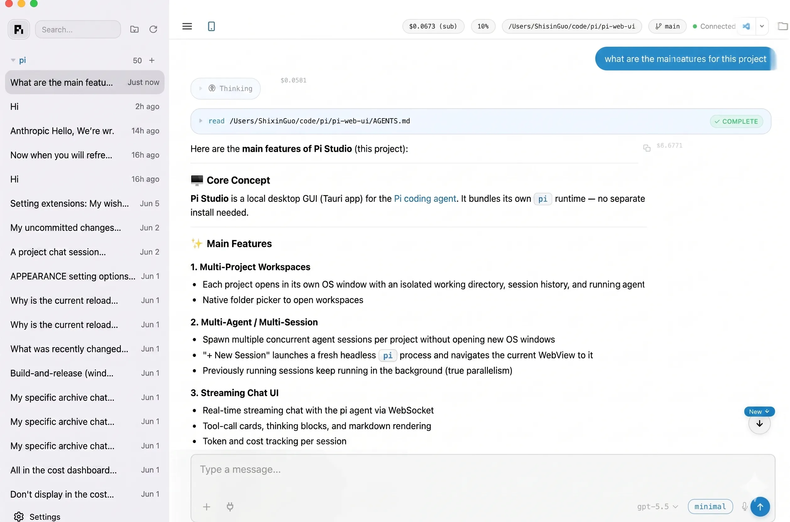
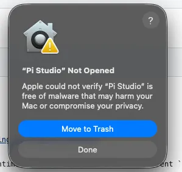
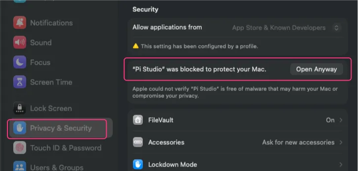
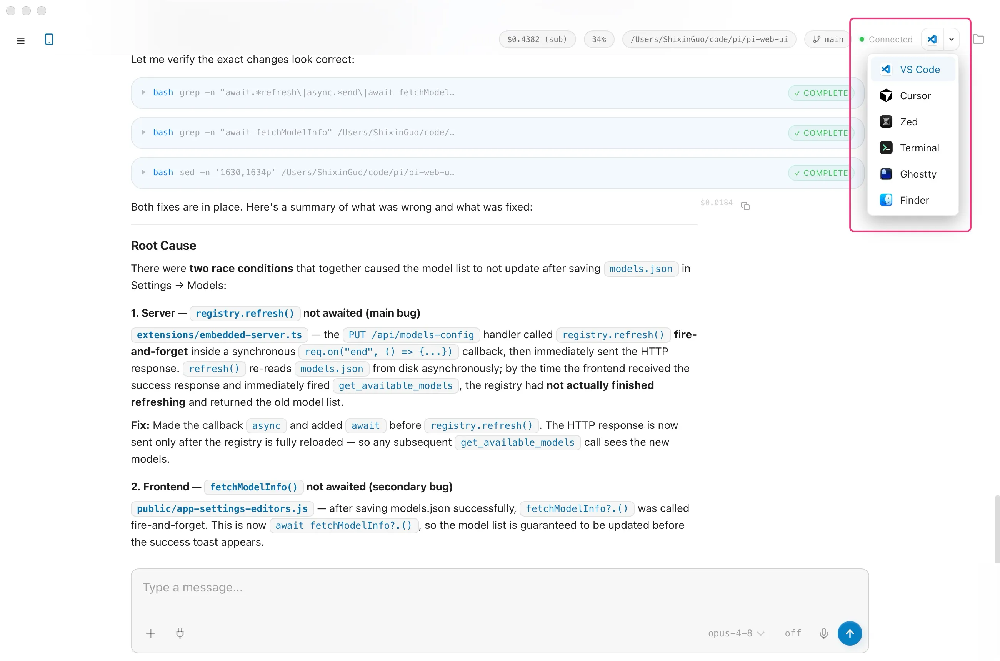
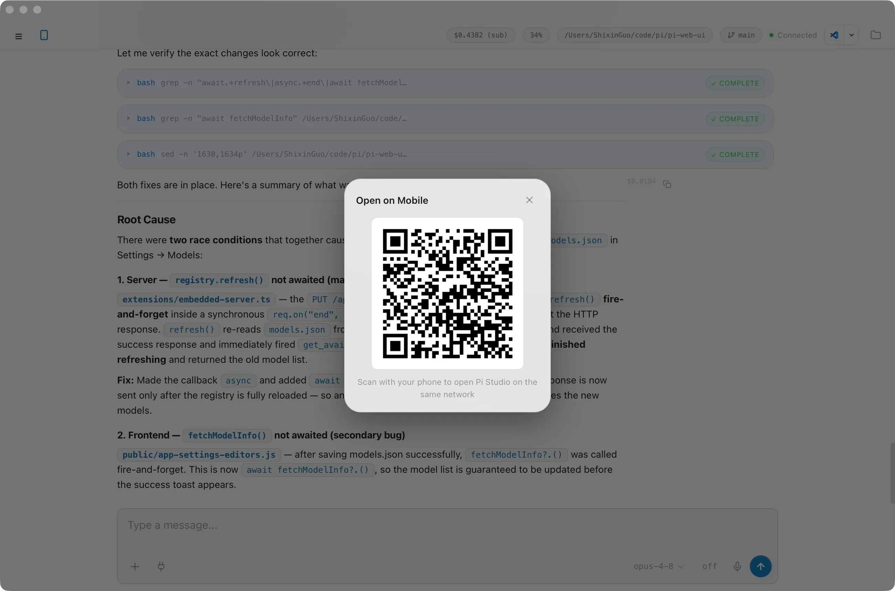
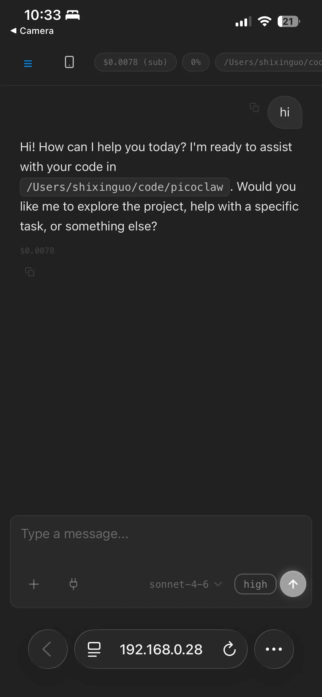
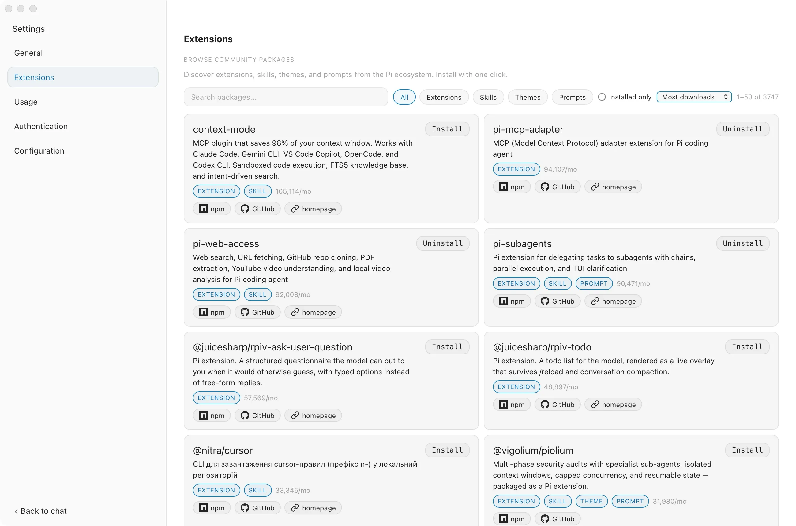
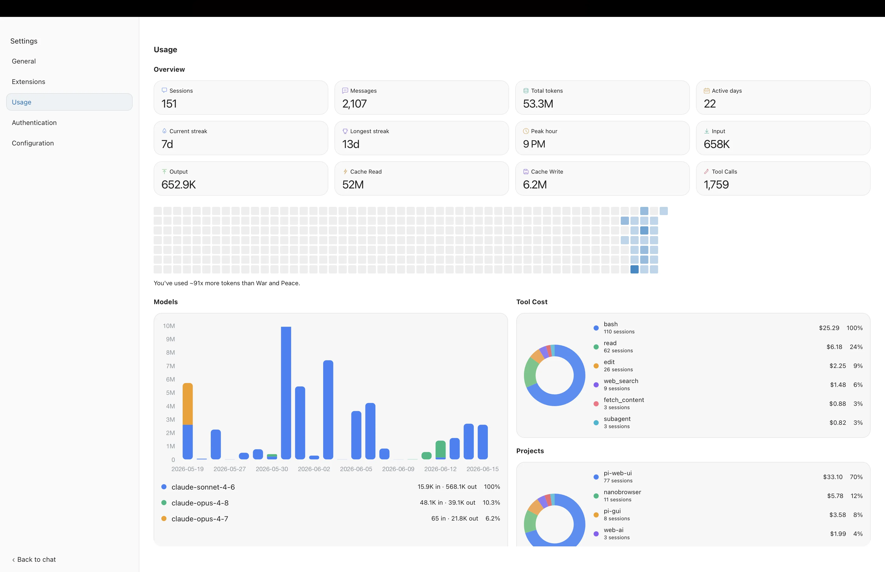
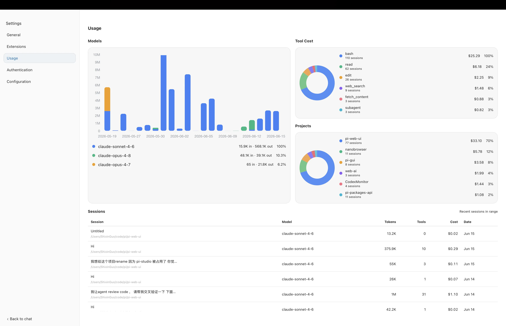
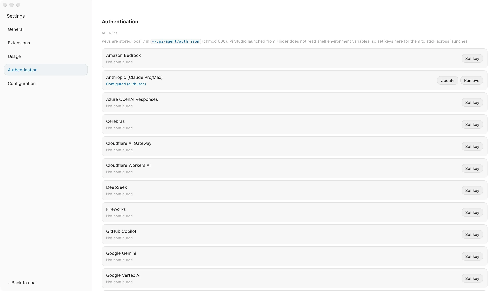

# Picot （π-cot(e)）

[English](./README.md) | **中文**

本地桌面 GUI，专为 [Pi](https://github.com/badlogic/pi-mono) 编程 Agent 打造。无需云端，无需账号，完全在本机运行。

[](./LICENSE)
[](https://github.com/shixin-guo/picot/releases)
[](#%E5%AE%89%E8%A3%85)

Picot 将 `pi` 运行时**直接打包进 .app**，无需单独安装 `pi`，无需配置 PATH，也不存在版本不一致的问题。打开任意项目文件夹，与 Agent 对话，浏览会话和文件——无需打开终端。多个项目可以并行运行，每个项目有独立窗口和独立 Agent 进程。

<p align="center">
  
</p>

---

## 目录

- [安装](#安装)
- [快速开始](#快速开始)
- [功能特性](#功能特性)
- [开发者指南](#开发者指南)
- [上游关系](#上游关系)
- [License](#license)

---

## 安装

macOS / Linux:

```bash
curl -fsSL https://raw.githubusercontent.com/shixin-guo/picot/main/scripts/install.sh | bash
```

Windows (PowerShell):

```powershell
irm https://raw.githubusercontent.com/shixin-guo/picot/main/scripts/install.ps1 | iex
```

或 [从 GitHub Releases 下载](https://github.com/shixin-guo/picot/releases)。

**无需单独安装 `pi` CLI** — Picot 内置了自己的 pi 运行时。

### macOS 未签名提示

Picot 目前发布的 macOS 版本未经 Apple 开发者 ID 签名/公证，系统可能弹出：

`"Picot" 无法打开，因为无法验证开发者。`

**解决方法：**

1. 将 `Picot.app` 拖入 `/Applications`
2. 右键点击 → **打开**
3. 若仍被阻止：**系统设置 → 隐私与安全性 → 仍要打开**

<p align="center">
  
</p>

点击**完成**：

<p align="center">
  
</p>

---

## 快速开始

1. 启动 **Picot**
2. 点击项目气泡或选择一个文件夹
3. 开始对话 — 嵌入的 pi Agent 会自动在该工作区启动

可以通过任意工作区内的 `pi /login`、shell 导出的 provider 变量，或「设置 → 配置」提供模型凭证。设置页保存的 API 密钥使用 Pi 已有的 `~/.pi/agent/auth.json` 格式。界面提供英文和中文。

---

## 功能特性

### 📸 界面预览

<p align="center">
  
</p>

<details>
<summary><strong>💬 对话</strong></summary>

- 完整 Markdown 渲染，代码块语法高亮
- **流式响应**，实时打字效果（基于 remend）
- 图片附件支持——粘贴、拖放或按钮上传
- 编辑工具调用的**内联 Diff 视图**（红绿行对比）
- 工具调用卡片和**思考块**实时渲染
- 一键复制任意消息
- 滚动到底部按钮，含未读消息提示
- **消息队列** — Agent 工作时可继续输入，消息以气泡形式排队，完成后自动依序发送
- **`@` 文件提及** — 在任意输入框输入 `@` 即可搜索并插入文件路径引用（工作区、`../`、`~/` 或绝对路径）；主聊天、Side Chat、Quick Chat 通用
- **对话轮次导航条** — 聊天区旁的 Codex 风格圆点轨道，悬浮预览、点击跳转到对应轮次
- **命令面板** — 快速执行压缩上下文、展开/折叠所有工具卡片、打开设置、查看帮助
- **从任意消息分叉** — 从对话中任意一点分叉出新会话

</details>

<details>
<summary><strong>⚡ 临时对话</strong></summary>

- **Side Chat** 在当前工作区启动独立且不保存的 Pi 进程，保留工具能力；可与文件标签共用右侧面板，最多打开五个——只要还有 Side Chat 标签，关闭最后一个文件标签也不会收起面板，仅在文件与 Side Chat 标签都关闭后才收起。
- **Quick Chat** 是单个非模态、禁用工具且不保存的对话；从侧栏搜索框后紧邻的图标打开。
- 两者都与主聊天共用模型选择、思考等级、语音输入和图标控件；仅在已认证的桌面窗口可用，移动端与局域网访问中不会显示。

</details>

<details>
<summary><strong>🗂️ 多会话 & 多 Agent</strong></summary>

- **多 Agent 并行** — 每个会话启动独立的 headless pi 进程，不弹新窗口，不中断已有会话
- 从侧边栏浏览并恢复任意历史会话
- 跨所有会话历史**全文搜索**，高亮匹配片段
- 会话按创建时间排序，活跃会话显示绿点
- 内联重命名、收藏、标签和筛选
- **工作区 Focus** — 点击当前工作区的箭头，将左侧栏切换为任务视图；即使新任务尚未创建第一个保存的会话也可进入
- **安全单条删除** — 可从 Focus 或「已归档」删除会话；运行中的会话会被服务端拒绝
- **最近访问** — 跨工作区的最近使用列表固定显示最后访问的五个会话

</details>

<details>
<summary><strong>📥 Agent Inbox</strong> <sub>（Beta）</sub></summary>

- 接入 Telegram Bot — 收到的私信会进入一个固定置顶的 **Agent Inbox** 会话，与普通项目对话区分开
- 可将 Inbox 中的任务派发给任意已打开项目的 Agent，在可伸缩的任务面板中追踪 待处理 / 运行中 / 已完成 状态
- 任务生命周期事件（已派发、需要更多信息、完成、失败）会回传到 Inbox，并可回复给原始 Telegram 用户
- 设置中内置 Telegram Doctor 检测，快速诊断 Bot / Token / 连通性问题

</details>

<details>
<summary><strong>🗃️ 项目与工作区</strong></summary>

- **多项目** — 每个项目独立窗口、工作目录、会话历史和 Agent
- 项目头部显示**当前 Git 分支**
- **在外部编辑器中打开** — 直接从 Picot 启动 VS Code、Cursor 等
- 原生文件夹选择器，无需使用终端打开项目

</details>

<details>
<summary><strong>📱 移动端 & 局域网访问</strong></summary>

<p align="center">
  
</p>
<p align="center">
  
</p>

- **局域网二维码** — 扫码即可在同网络的任意设备上访问 Picot
- 移动端 URL 优化处理，支持 PWA 安装（iOS/Android 可添加到主屏幕）

</details>

<details>
<summary><strong>📦 包管理器</strong></summary>

<p align="center">
  
</p>

- 在 UI 内浏览、安装和删除社区包
- 基于 `pi install`，无需额外命令

</details>

<details>
<summary><strong>💰 费用 & 用量面板</strong></summary>

<p align="center">
  
</p>
<p align="center">
  
</p>

- 每个会话实时 Token 用量和费用追踪
- 完整费用面板，含信息栏、趋势图和按模型分类
- **上下文窗口可视化** — 点击 Token 气泡查看已缓存 Token、新输入和可用空间

</details>

<details>
<summary><strong>🎨 主题 & 外观</strong></summary>

- 六款内置主题：**Dusk（默认）**、Dawn、Midnight、Clean、Terracotta、Sage
- 毛玻璃头部和输入栏（`backdrop-filter: blur`）
- macOS 原生标题栏 overlay 集成
- 支持从顶部**拖动窗口**，媲美原生 App 体验
- **语言** — 可在英文、简体中文和跟随系统之间即时切换

</details>

<details>
<summary><strong>🎤 语音输入</strong></summary>

- 输入框中的麦克风按钮，调用 Web Speech API（本地语音识别）
- 实时转录到输入框，录音时红色脉冲动画

</details>

<details>
<summary><strong>🗄️ 文件浏览、预览与编辑</strong></summary>

- 右侧边栏提供懒加载的工作区文件树
- 单击文件即可在可调整宽度的标签预览面板中打开；每个工作区独立恢复标签
- 可预览 Markdown、图片、PDF 文档和源代码；Markdown 渲染前会经过安全清理
- 内置 CodeMirror 编辑器可编辑受支持的文本文件，提供语法高亮、自动换行、搜索、跳转行、自动保存和外部修改冲突保护
- 双击文件可使用系统默认桌面应用打开
- 将文件从树中拖到聊天输入框，可插入工作区相对的 `@path` 引用

</details>

<details>
<summary><strong>⚙️ 设置 & 控制</strong></summary>

<p align="center">
  
</p>

- 模型选择器，支持搜索/筛选和键盘操作
- 思考级别切换（关闭 / 低 / 中 / 高）
- 自动和手动**上下文压缩**，含状态显示
- 推送通知开关
- **技能管理** — 设置 → 技能：按 source root 浏览所有发现的技能，用 Pi 的 `!`/`+`/`-` 规则语义启用/禁用单个技能或整组（下次会话/重启后生效）
- **自动更新** — 设置 → 通用 → 更新，一键应用内升级

</details>

---

## 开发者指南

### 架构

Picot 启动 Rust `HostServer` 和受管的 native `pi --mode rpc` 进程。WebView 连接 host 的 `/v2/ws`，host 再通过 stdio RPC 与 Pi 通信。打包的 `embedded-server.mjs` 扩展负责 Tauri WebView 所通信的 HTTP/WebSocket 层（静态资源、`/api/*`、`/ws`）；`picot-bridge.mjs` 只注册 Picot 专用 Pi 命令。

```
┌──────────────────────────────────────────────────────┐
│ Picot .app                                       │
│                                                      │
│   Tauri + native HostServer (Rust)                   │
│      ├─► 启动 pi --mode rpc --extension embedded-server.mjs --extension picot-bridge.mjs │
│      ├─► 通过 /v2/ws 桥接 stdio RPC 帧              │
│      └─► OS 窗口 ──► WebView ──► native host HTTP    │
│                                                      │
│   resources/                                         │
│      ├─ public/             (前端)                   │
│      ├─ extensions/         (embedded-server + picot-bridge) │
│      └─ pi/                 (bun 编译的 pi 二进制)   │
└──────────────────────────────────────────────────────┘
                       │
                       ▼ 读取 / 写入
              ~/.pi/agent/
                 ├─ sessions/   (对话历史)
                 ├─ auth.json   (API 密钥)
                 └─ settings.json
```

> 此图为面向公众的简化版本，与 [`AGENTS.md`](./AGENTS.md#read-first) 中的架构说明保持同步——那里还包含项目目标、约束条件，以及各模块的贡献规范。

### 集成的 Pi 能力

Picot 不重新实现 Agent 逻辑——它内嵌 Pi 并通过原生 UI 暴露其运行时能力。

- **内嵌 `pi --mode rpc` 运行时** — 每个工作区一个独立的托管进程，按项目隔离
- **流式 RPC 桥接** — 逐 Token 输出、工具调用事件和思考块实时渲染
- **会话生命周期 API** — 创建、切换、恢复会话，完整的按项目历史
- **Native host 服务** — Rust 负责每个工作区 `pi` 进程的生命周期、端口分配、broker WebSocket 和窗口管理，并将浏览器帧桥接为 Pi RPC
- **WebSocket Broker** — 多个 UI 客户端可同时连接同一个 pi 进程
- **扩展兼容** — 自动加载 `~/.pi/agent/extensions/` 和 `.pi/extensions/` 中的用户扩展
- **凭证复用与设置** — 读取 Pi 已有的 `~/.pi/agent/auth.json`，GUI 启动时导入 shell 导出的 provider 变量，也可以在设置页保存 API 密钥

### 从源码构建

```bash
git clone https://github.com/shixin-guo/picot.git
cd picot
bun install --frozen-lockfile
bun run dev      # 下载内嵌 pi 二进制 + 启动 tauri dev 热重载
```

发布构建：

```bash
bun run build    # 下载内嵌 pi 二进制，然后运行 tauri build
```

修改 `src-tauri/` 下的文件后：

```bash
bun run check:rust   # cargo check + clippy + fmt（快速，无需完整构建）
```

完整命令参考（测试、lint/format、Rust 检查、升级内嵌 pi 版本等）见 [`AGENTS.md` → Toolchain 与 Verification](./AGENTS.md#verification)。

### 项目文档

- [`AGENTS.md`](./AGENTS.md) — 架构、模块规范，以及本仓库（人类或 Agent）工作时的完整命令参考
- [`ROADMAP.md`](./ROADMAP.md) — 已完成、进行中和计划中的功能
- [`ARCHITECTURE.md`](./ARCHITECTURE.md) — 详细架构、不变量与设计文档

---

## 上游关系

Picot 是 **Tau** 的维护性 fork，专为 Pi 优先的本地开发工作流定制。主要增强：

- **Native Pi runtime manager** — 启动并监管 `pi --mode rpc` 进程
- **内嵌 pi 运行时** — 无需全局安装，Picot 自带二进制
- **Protocol v2 host bridge** — 为 runtime、data、auth 和 extension UI 帧提供路由
- **Host data plane** — Rust 直接向 native UI 提供会话和工作区数据

---

## License

MIT
